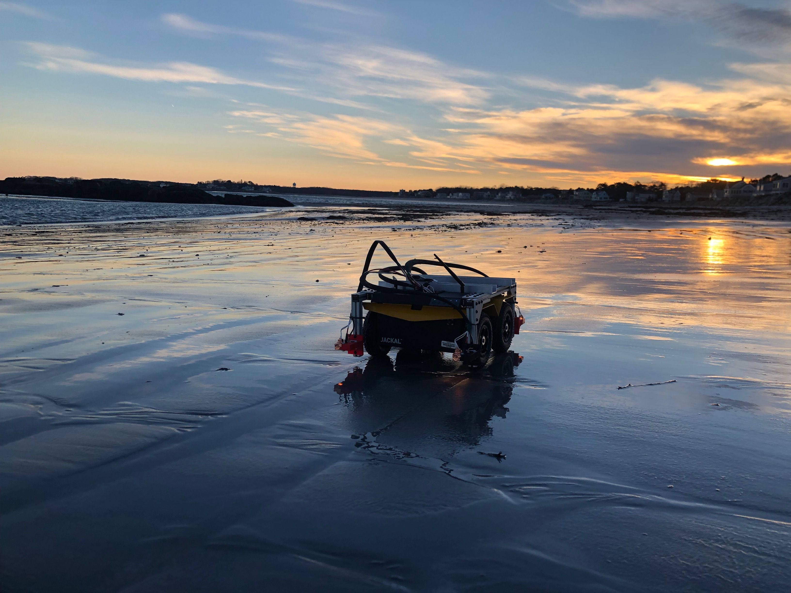

# Visual and Spectral Terrain Classification (VAST)




This repository contains the associated code for the paper "VAST: Visual and Spectral Terrain Classification in Unstructured Multi-Class Environments", presented at IROS 2022 in Kyoto, Japan.

## Preparing Workspace
```
# Install requirements (can be done in a virtual workspace)
cd vast_terrain_classification
pip3 install -r requirements.txt
# Clone the data repository inside the classification repo
git clone git@github.com:RIVeR-Lab/vast_data.git data
# Training Individual Network Features
python3 train_imu.py
python3 train_spec.py
python3 train_img.py
# Edit final networks names in gen_fused_features.py
# Generate the fused features from individual networks
python3 scripts/gen_fused_features.py
# Create Test Train Indices
python3 scripts/create_test_train_indices.py
# Train Fused Network
python3 train_fused_net.py
# Evaluate Fused Network
python3 eval_fused_net.py
```

## Citing the Work
If you use the methodologies or data associated with this paper, please include the following citation:

```
@inproceedings{
  hanson2022vast,
  title={Vast: Visual and spectral terrain classification in unstructured multi-class environments},
  author={Hanson, Nathaniel and Shaham, Michael and Erdo{\u{g}}mu{\c{s}}, Deniz and Padir, Ta{\c{s}}kin},
  booktitle={2022 IEEE/RSJ International Conference on Intelligent Robots and Systems (IROS)},
  pages={3956--3963},
  year={2022},
  organization={IEEE}
}
```

### Questions
We welcome feedback and questions regarding our work. For code related questions, please open an issue with GitHub. For research questions or collaborations, please contact the corresponding author at hanson [.] n [@] northeastern [.] edu.